Kevin Turner Apr 2016

Pre-requisites
==============

Working on the assumption that we are working with a blank canvas, the following things must be installed on any system (regardless of platform):

**PostgreSQL**
--------------

If not already supplied on the platform, download appropriate version from <http://www.postgresql.org/download/>

Also **pgAdminIII** (from the same site) is pretty much essential.

Redis
-----

At the time of writing redis is supported on Windows and can be installed by downloading from <https://github.com/MSOpenTech/redis/releases>

I also ran into an error using redis: "MISCONF Redis is configured to save RDB snapshots, but is currently not able to persist on disk."

To fix that I ran **c:\\program files\\redis\\redis-cli**

then

**config set stop-writes-on-bgsave-error no**

Not a solution but a workaround

Node
----

Install the latest version of Node from <https://nodejs.org/en/download/>

Sails
-----

This is the framework upon which the Chromis for Node server is based. You can read about it here: <http://sailsjs.org> but for now install it globally using npm:

**npm install sails –g**

Git
---

Used for all source change management: <https://git-scm.com/downloads>

Background reading: <http://readwrite.com/2013/09/30/understanding-github-a-journey-for-beginners-part-1>

GitHub
------

If you have not already got an account, register at <https://github.com/>

**JSDoc**
---------

For better or for worse, we currently use JSDoc to create documentation from our source comments:

**npm install jsdoc –g**

**Windows**
===========

If you are a developer working on a Windows PC, the following tools are useful additions to your armoury for developing and testing:

**TortoiseGit**
---------------

By no means an essential tool but quite useful for a Windows Explorer GUI interface to Git (which is primarily a command line tool): <https://tortoisegit.org/>

Visual Studio Code
------------------

If you don’t already have a favourite editor, this is a very nice lightweight editor to use with many languages: <https://code.visualstudio.com/>

If you install this, be sure to allow it to add an option to windows explorer to enable you to open resources with vs code from the context menu.

We also need to make a small config change:

Edit the following file – best using VS Code (**Run as Administrator** to get permissions).

C:\\Program Files (x86)\\Microsoft VS Code\\resources\\app\\extensions\\html\\package.json 

Change the “extensions” JSON property so it looks like this:

**"extensions": \[ ".html", ".htm", ".shtml", ".mdoc", ".jsp", ".asp", ".aspx", ".jshtm", ".rml", ".ejs" \],
**

Copy

C:\\Program Files (x86)\\Microsoft VS Code\\resources\\app\\extensions\\html
to
C:\\Users\\&lt;user&gt;\\.vscode\\extensions

C++ compiler
------------

Some packages from npm need to be compiled. At the time of writing there is a big song and dance about the fact that some things cannot be created on Windows, but there is a workaround if it is still required when you read this:

Install compiler: <https://github.com/nodejs/node-gyp/issues/629#issuecomment-153196245>

### Summary

Install VC++ Build Tools Technical Preview, choose Custom Install, and select both Windows 8.1 and Windows 10 SDKs.

NOTE: \[Windows 7 only\] requires .NET Framework 4.5.1

Install Python 2.7, and add it to your PATH, "npm config set python &lt;insert path to your python.exe - e.g. C:\\Python\\python.exe&gt;"

Also add the path to the python.exe to your windows PATH environment variable.

Launch cmd, "npm config set msvs\_version 2015 --global"

(this is instead of npm install \[package name\] --msvs\_version=2015 every time.)

A useful resource: <https://github.com/Microsoft/nodejs-guidelines>

Setting up a development environment
====================================

Cloning the repos
-----------------

At the time of writing there are four repos on Github of interest.

1.  The **Chromis for Node** server repo: <https://github.com/kpturner/chromis.git>

2.  The **Chromis for Node Migration** repo: <https://github.com/kpturner/chromis-mig.git>

3.  The **Chromis for Node Models** repo: <https://github.com/kpturner/chromis-models.git>

They are private, so you need to be granted access by the owner (me).
 

Why are these all separate? Well Chromis for Node is an application in its own right, but needs to make use of the **Chromis for Node Models** repo and the **Chromis client assets** repo. The **Chromis for Node Models** repo is also used by the **Chromis for Node Migration** application, and the **Chromis client assets** is also used by the **Chromis for RPG application**. So every multi-homed repo is managed as a separate entity. This has advantages and disadvantages, but that is the way it is for now.

### Chromis for Node

Clone the Chromis for Node repo onto your local machine (I used **c:\\users\\&lt;user&gt;\\repos\\chromis** as the home for this).

Then clone the **Chromis client assets** repo from Bonobo into a directory called **c:\\users\\&lt;user&gt;\\repos\\chromis\\assets**.

Then clone the **Chromis for Node Models** repo into a directory **c:\\users\\&lt;user&gt;\\repos\\chromis\\api\\models\\framework\\models **

You should now be able to open the **c:\\users\\&lt;user&gt;\\repos\\chromis** with Visual Studio Code and see this sort of structure:
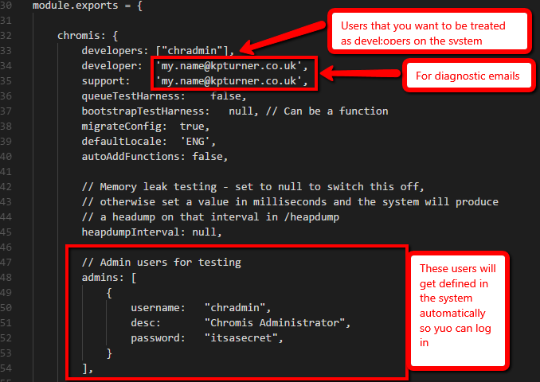

If you now open a command prompt (or powershell) and navigate to the **c:\\users\\&lt;user&gt;\\repos\\chromis** you can complete the set up process by running: **npm install**

### Chromis for Node Migration

I have written this application purely to facilitate the migration of (relevant) data from the IBMi database to the PostgreSQL database(s). It isn’t finished. It is a working project that I add to as and when I want to migrate another table. The first thing to do (and I already have) is to get all the existing data in JSON format ready for import/staging/migration).

If you look on the ChromisDEV server you can see a directory in the IFS called **chr-migration**. In here is a subdirectory called **data** that contains a .js file for each table in the Framework – each file simply containing a JSON of all the data within that file. Along with the **data** subdirectory, there is are also files named after tables that contain the model (schema) definition for those tables as they would be defined in the Chromis for Node system. Needless to say I did not create all this stuff manually. You can generate it all at any time using the MIGSCHEMA command in chromis:
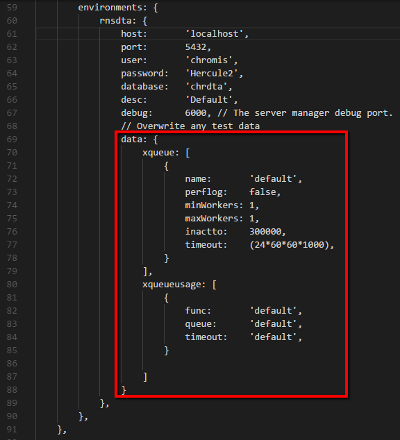

I did this for both the Chromis library and the CHRDTA library.

There is also a NetServer shared called ChromisMIGRATION that points to this directory, and you need to be able to access that from your PC: [\\\\Chromisdev\\ChromisMIGRATION] (Note: people always have issues with this and it is usually because their netserver user id has been disabled or they are using the wrong credentials. See help from IT services if you are clueless about this).

Anyway, enough of the prelims, go ahead and clone the **Chromis for Node Migration** repo into your favourite location. I used **c:\\users\\&lt;user&gt;\\repos\\chromis-mig**.

In the same way as you did previously, clone the **Chromis for Node Models** repo into **c:\\users\\&lt;user&gt;\\repos\\chromis-mig\\api\\models\\framework\\models**

So now we have a copy of the repo in two places. You may prefer to have it in one place and use some sort of symbolic link – good luck with that – I can’t be bothered. If you use my approach, you have to remember that changes you make in one have to be committed and pushed so that they can be pulled in the other – same thing applies to the assets folder, since the assets are shared with the Chromis for RPG server also.

If you now open a command prompt (or powershell) and navigate to the **c:\\users\\&lt;user&gt;\\repos\\chromis-mig** you can complete the set up process by running: **npm install**

Finally, drag the contents of [\\\\Chromisdev\\ChromisMIGRATION] into a directory called **c:\\users\\&lt;user&gt;\\repos\\chromis-mig\\chr-migration**

You are now ready to migrate data to PostgreSQL…..but first:

Database(s)
-----------

Set up your empty database in PostgreSQL. You can have multiple databases (like you can have multiple environments on the IBMi) but for the sake of simplicity we will just set up one called **chrdta** and make sure that a user called **chromis** is authorised to fiddle with it. In addition, we need a database for the tables that live in the program library on the IBMi – this will simply be called **Chromis**. Both databases also need a migration database that is used to stage data between the old IBMi format and the new model/schema format. Therefore, in total, we need 4 as a minimum:

-   Chromis

-   Chromismig

-   chrdta

-   chrdtamig

You should have a new application installed called **PGAdminIII**. Spin that up…..

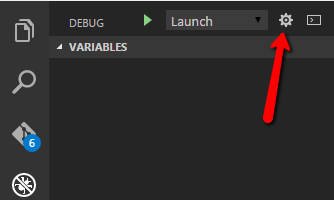

Double click on the first (only) server in the tree.

Right click on “Login Roles” and create a new user called **chromis** with a password of **Hercule2**. Make sure it is has “super” privileges to avoid annoying permission issues:

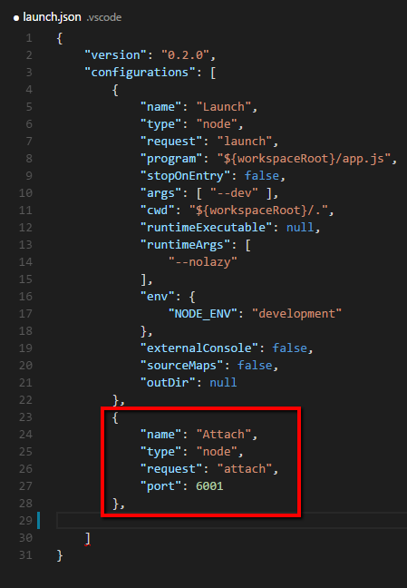

Back to the main pane, right click on “Databases” and create the four new databases mentioned above.

Some basics about a Sails.js application
========================================

All the config for the server (or at least all the config that we don’t store in database tables) is stored in individual .js files in the application /config directory. There is a lot to take in at first as there are lots of config files for various parts of the system. Without wishing to muddy the water, the only thing you really need to be aware of at this stage is:

1.  These files are under source control in Git, so anything in these files is valid across all instances

2.  One special file called **/config/local.js** is \*not\* under source control in Git, so in here you can override any of the other config options with things that you want to be uniquely different in your own instance of the server

For your convenience, there is a **/config/local.example** file that you can copy and name as **/config/local.js** and you are good to go.

If you want to delve deeper: <http://sailsjs.org/documentation/anatomy/my-app>

Migrating the data
==================

The very first time we try to run this migration we want two things to happen:

1.  We want staging to take place. Staging is where the raw data from the /chr-migration folder (remember it is all held in chr-migration/data in individual .js files) is imported into a table of the equivalent name in the appropriate **xxxmig** database. For example, XUSER from CHRDTA will be stored in a table called **xuser\_mig** in a database called **chrdtamig**.

2.  We want any models we have (new or changed) to have those changes reflected in the database – otherwise we won’t have anything to store the data in

On subsequent runs (let’s say we have fixed a migration bug in the code) we may not want either of things to take place, since they are time consuming. We would only want 1) to happen again if we have pulled more/different data from the IBMi using MIGSCHEMA. We would only want 2) to take place if we have added or changed any of the tables we want to migrate. The latter is more common than the former.

We can influence both options in the aforementioned /config/local.js file.

If you navigate to the **c:\\users\\&lt;user&gt;\\repos\\chromis-mig** directory in windows explorer you can right-click and take the “Open with code” option. When it is loaded up, you can edit /config/local.js

The names of the options etc can be confusing because they are meaningful to sails, but suffice to say if you want 1) Staging to take place (and you do first time in) and you want 2) model migration to take place you should set the values like this:

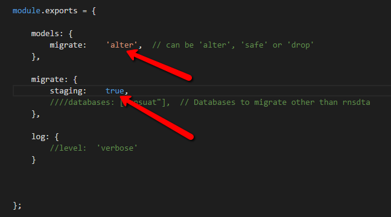

After the first run you should reset these values to **‘safe’** and **false**.

***NOTE: You may have to run the migration more than once if you find that there is no data in XUROLE. You usually only notice when you log in to Chromis and find you have no functions or widgets.***

For information, the main configuration regarding migration – i.e. how data is mapped from the old to the new tables – is stored in **/config/map.js** In the words of the Firefox developers. “here be dragons!”

So now on to running a migration so we have some data to use.

Click this button to get into debug mode. This is where we can launch the application:

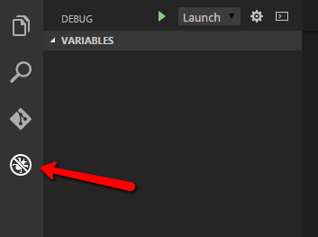

Once here, you can fire things up by clicking here:

At first it will whinge at you because it won’t know what launch config to use. It will prompt you to select one, so choose node.js and accept the default settings for this.

Now the application will start and you will see the console messages popping up. Eventually, all being well, it should look like this (or something similarly reassuring):

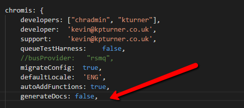

Running the Chromis for Node server 
================================

We should load up the Chromis for Node application in VS Code in the same way we did for the migration app, so navigate to the **c:\\users\\&lt;user&gt;\\repos\\chromis** directory in windows explorer you can right-click and take the “Open with code” option. When it is loaded up, you can edit /config/local.js (assuming you have copied the /config/local.example file previously).

Let’s have a look at that and explain some of the options that you need to know about to start with:

The following table details some additional start up parameters that may be of interest.

| **Property**     | **Value** | **Function**                                                                                                                           |
|------------------|-----------|----------------------------------------------------------------------------------------------------------------------------------------|
| autoAddFunctions | Boolean   | If enabled, on startup the database will be populated with any new functions that have been created inside ‘./api/functions/\*/\*.js’. |

The “migrateConfig” option is interesting because further down the config file you can see a definition for each environment and within that you can specify data for config files that you want populated in the database – so here we are setting up the queues we want (same as back-end server queues on the RPG server):

You can do the same with any table if you want your local instance to have specific data (as opposed to the stuff obtained via a migration).

Next thing: create a settings.xml file in the /assets folder that looks like this:

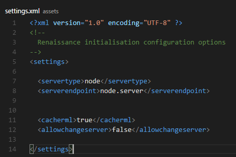

For copy-n-paste purposes:

&lt;?xml version="1.0" encoding="UTF-8" ?&gt;

&lt;!--

Chromis initialisation configuration options

--&gt;

&lt;settings&gt;

&lt;servertype&gt;node&lt;/servertype&gt;

&lt;serverendpoint&gt;node.server&lt;/serverendpoint&gt;

&lt;cacherml&gt;true&lt;/cacherml&gt;

&lt;allowchangeserver&gt;false&lt;/allowchangeserver&gt;

&lt;/settings&gt;

What runs when I start it up?
-----------------------------

It is very similar to what you will be used to with the RPG server. The following things start:

### Main server

The main server. This will listen for traffic on a specific port. The port is determined thus:

1.  If specified in **local.js** that will be used at all times

2.  If not, then if you are running in development mode the port is defined in **/config/env/development.js**

3.  If not, then if you are running in production mode the port is defined in **/config/env/production.js**

4.  If not, then the port is derived from an environment variable called PORT

5.  If all else fails it will listen on port 1337

If you are in debug mode, the debugger for the main server will listen on port 5858

When the server is started you run it locally – for example: <http://localhost:1337>

### Server Manager

A server manager process will start for each environment that you have defined. Think of this as the equivalent of the back-end server manager for an RPG Chromis environment. If you are in debug mode, then debugging will be available by attaching to the debug port you defined for the environment in the config. In our example “chrdta” uses port 6000 for debugging. For each environment you define, keep the debug port at least 1000 apart (so the next one would be 7000). This is just a convention, but the reason will become clear.

### One or many back-end servers for each queue defined

One or more back-end server processes will start for each queue you have defined. You can define the maximum and minimum number of servers to have, and the manager will increase/decrease these depending on demand – very much like the RPG equivalent. Each server that starts when you first fire things up will, if in debug mode, allow debugging on a port that increments from the server manager for the environment. So if the environment server manager is using port 6000 for debugging, the first back end server will use 6001, the second 6002 and so on. That is why the server managers need to have a decent gap between the ports they use.

As with the RPG server, debugging is easier if you configure your local setup to only have one queue so you can guarantee that requests will go to the back-end server you are debugging.

Starting and debugging
----------------------

The normal way to start the server is exactly the same way as was defined previously to start the migration server. This will start up the main server, and you can use the built in debug facilities in Visual Studio Code to set break points etc. If you want to use Visual Studio Code to debug a back-end server instead of the main server, then you can start the main server from a command line. Navigate to **c:\\users\\&lt;user&gt;\\repos\\chromis** and run

**npm install** *(only needed the first time you go to start it)*

**node --debug app.js**

If you want more logging you can use

**node --debug app.js --verbose**

or even

**node --debug app.js --silly**

When it starts you will see the server managers start (and listen on a debugging port) and the back-server(s) starting and listening on a port. So to debug them we need to tell Visual Studio Code to “Attach” to a port as opposed to the default “Launch”. There is a **launch.example** file in the root which can be copied into a directory called **.vscode** and renamed to **launch.json** – OR we need to configure VS Code to understand what we want to do when we attach. Click here:

The launch.json will appear in the editor (you may have to select node.js as the execution environment first). We then configure some “Attach” settings for debug ports we want to attach to:

Now, with the server running in your command window, you can attach to, and debug, the other processes from within VS Code. You can use the drop down box to switch from “Launch” to your preferred “Attach” config and start the start button  :

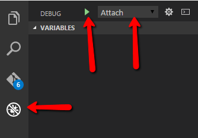

Breakpoints can be added/removed from code simply by clicking in the left margin:

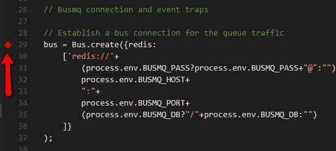

Anatomy – where do my functions live?
=====================================

This is all pretty much identical to the RPG server. To develop a framework function called **myapp** (using the Framework as an example), you would create a directory called **/assets/res/framework/functions/myapp**

Within that folder you would create your RML file: **myapp.rml**

Here is the fundamental difference. The model handling program/function that runs on the back-end to serve your RML is no longer an RPG program. It is a node module that lives in **/api/functions/framework/**, so you would also create **myapp.js** in that folder. As with the client side code, applications are in **/api/functions/apps/&lt;app&gt;**

What does a function look like?
===============================

A large assumption here that the reader understands JavaScript and, more importantly, understands node.js. This is not a training document! Anyway, whether or not you know this stuff, there is an example function. Its structure is very similar to the RPG equivalent. This example is correct at the time of writing but of course this may alter as things progress and improve.

Look at **/assets/res/framework/functions/example/example.js**

Basically there are two places to do your stuff – the “initialise” function and the “process” function – pretty much like the RPG equivalent. You have helper services for the model handling (self.MOD) and for session related stuff (self.SES). The code for these (they are Sails hooks) can be found in

How to run in Production Mode
=============================

**node app.js --prod**

How do I apply hotfixes (or cachebust)
======================================

As mentioned previously, if you are running the development mode then your back-end functions get reloaded every time, but what if you are running in production mode or you make changes to other areas of the Framework? In the RPG world we had ChromisHOTFIX and/or CACHEBUST but that was confusing for some. Now you can just do one of two things from a command prompt (once you have navigated to the application directory):

**node hotfix.js** (fixed get picked up when the user next logs on)

**node hotfix.js --reload** (prompts connected users to reload)

Online API documentation
========================

Visit the **/doc** endpoint on your browser when running Chromis. The docs get generated by a tool called **jsdoc** when you start the server in development mode. For it to work, you obviously need jsdoc installed, so if you have not already done so**: npm install jsdoc –g**

As well as being generated at startup, you may regenerate the docs at any time by running **createdocs.sh**

Your PC may not know how to run shell scripts, but it should prompt you and you can select the Git Bash option available from a previous install of Git for Windows. As a personal preference, I like to associate the .sh extension with **c:\\program files\\git\\bin.sh.exe** as stdout etc seems to then appear in the same window.

If you get fed up with generating the docs every time you start the server, you can switch it off in /config/local.js:
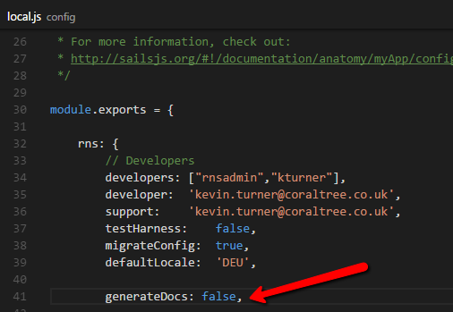

Notes on creating the readme.md markdown file for github
========================================================

If you change the documentation (readme.docx) you must also save it as a PDF. Additionally, use must create a markdown file for GitHub called readme.md.
To do this, make sure you have a tool called pandoc installed: <http://pandoc.org/>

Then navigate to the “events” project directory that contains readme.docx and run this command:

***createreadme.sh***

  [\\\\Chromisdev\\ChromisMIGRATION]: file:///\\Chromisdev\ChromisMIGRATION
